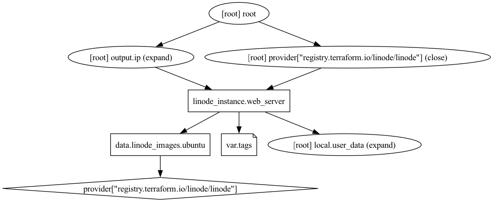

# Configurar una máquina virtual usando cloud-init

## Proceso
### 1. Seleccionar la distribución
   
Se define [una fuente de datos](https://registry.terraform.io/providers/linode/linode/latest/docs/data-sources/images#filter), para seleccionar la distribución de Linux con la que se creará la instancia.

> [Qué son las fuentes de datos?](https://developer.hashicorp.com/terraform/language/data-sources)

Para este ejemplo es preciso utilizar alguna [que soporte el servicio de metadata](https://www.linode.com/docs/products/compute/compute-instances/guides/metadata/?tabs=linode-cli,macos#availability), como Ubuntu, para configurarla como servidor web.

> [Qué es el servicio de metadata?](https://www.linode.com/docs/products/compute/compute-instances/guides/metadata/?tabs=linode-cli,macos#)

```
data "linode_images" "ubuntu" {
  filter {
    name   = "vendor"
    values = ["Ubuntu"]
  }

  filter {
    name   = "is_public"
    values = ["true"]
  }

  latest = true
}
```

### 2. Almacenar el script

Definir una variable local para el [script a ejecutar con cloud-init](https://www.linode.com/docs/products/compute/compute-instances/guides/metadata/?tabs=linode-cli%2Cmacos#add-user-data). En este caso, se instala Apache, configurando para que se ejecute utilizando el puerto 8080. También se predefine una página de inicio.

```
locals {
  user_data = <<-EOF
              #!/bin/bash
              apt-get update
              apt-get install -y apache2
              sed -i -e 's/80/8080/' /etc/apache2/ports.conf
              echo "<marquee><h1>Akamai Connected Cloud</h1></marquee>" > /var/www/html/index.html
              systemctl restart apache2
              EOF
}
```

### 3. Crear el servidor web

Se define la configuración de la máquina virtual para [crear la instancia](https://registry.terraform.io/providers/linode/linode/latest/docs/resources/instance). 

Igual que con la distribución, para este ejemplo es necesario seleccionar una región [que soporte el servicio de metadata](https://www.linode.com/docs/products/compute/compute-instances/guides/metadata/?tabs=linode-cli,macos#availability).

```
resource "linode_instance" "web_server" {
  region = "us-lax"
  label  = "web_server_tf"
  tags = var.tags
  image  = data.linode_images.ubuntu.images.0.id
  type   = "g6-nanode-1"
  metadata {
    user_data = base64encode(local.user_data)
  }
}
```

## Resultado

Al finalizar el proceso, se obtiene la URL del sitio, con base en la IP pública de la instancia y el puerto que se definió.

```
output "ip" {
  value = "Visita http://${linode_instance.web_server.ip_address}:8080"
}
```
## Grafo
